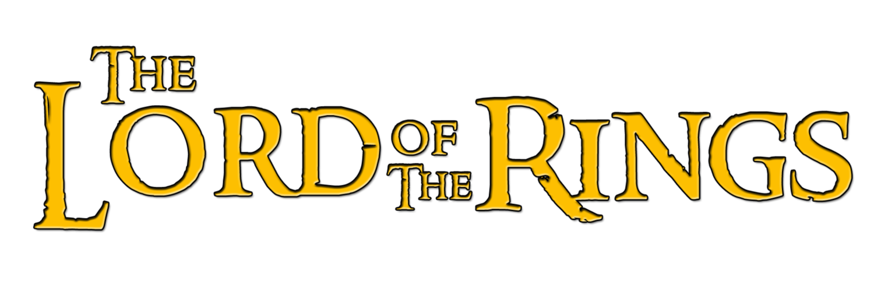

Phase 2 Project - Lord of the Rings Movie Information Site
=======================================

## Goals

- Build a React single page application from scratch
- Apply my knowledge of components, props and state management
- Incorporate client-side routing
- Use data from an API

## Overview

To apply my learning from Flatiron School's Software Engineering Program Phase 2, I am going to nerd out and make a Lord of the Rings movie trilogy website. This site will grab data from a free API and create a simple React app using that data. Users will be able to:

1. Look up LOTR character bios and quotes
2. Search and sort characters based on any of those pieces of information
3. Create their own character with an image, bio, and quote

## Project Requirements

1. Make a single page application (only one `index.html` file) using `create-react-app`.
2. My app should use at least 5 components in a way that keeps the code well-organized.
3. There should be at least 3 client-side routes using React Router, including a nav bar or other UI element that allows users to navigate between routes, and using RESTful routing conventions where applicable.
4. Use a `json-server` to create a RESTful API for the backend and make both a `GET` and a `POST` request to the json server. Use a form to make the post request, specifically a controlled form/component.
   - Keep the `json-server` data simple: avoid nested data and associations.
   - Upon return of json from the POST request, a state update by a setState function is required!
5. Add some styling, either by using `styled components` or writing CSS files and using id/className to style elements.

=======================================

More information at:
https://learning.flatironschool.com/courses/5249/pages/phase-2-project-guidelines?module_item_id=504654